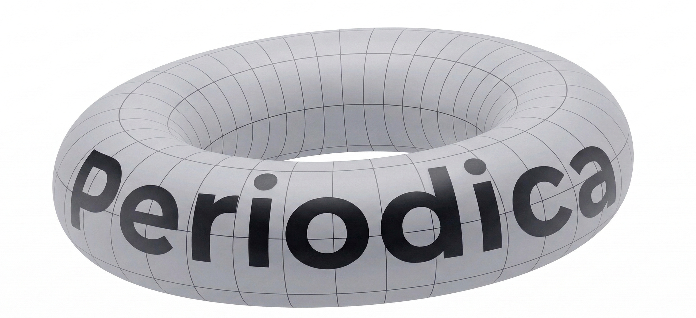

<h1 align="center">
</img>
</h1>

Periodica is a
C++ based Python library for analyzing the topological structures
of a periodic set. It can compute how the points connect with
each other (captured by the Delaunay triangulation) at different
length scales (encoded in the periodic merge tree and the
topological descriptors). For more information, please check our 
[CECAM workshop poster](cecam_poster.pdf).

## Build

```
make
```

This works on a fresh machine: it first runs `make setup`, which installs whatever is
missing among uv, bazelisk and node/npm, creates the Python venv and installs the
frontend's `node_modules`, and then builds the native extension. Missing tools are
installed per user without root: via Homebrew when it is available, otherwise from the
official releases into `~/.local` (set `USE_BREW=0` to force the latter,
`TOOLS_PREFIX=...` to choose another location). You still need a C/C++ compiler
(`xcode-select --install` on macOS, `build-essential` on Debian/Ubuntu).

## Web UI

A browser frontend (edit lattice/points/weights, visualize the periodic Delaunay
with a filtration slider, and view barcode/diagram/image descriptors) lives in `web/`:

```
make web                          # FastAPI backend on :8000 (serves web/frontend/dist if built)
cd web/frontend && npm install && npm run dev   # dev server on :5173
```

## References

Periodica is based on the following research papers:

```
@misc{EH2024,
    title         = {Merge Trees of Periodic Filtrations}, 
    author        = {Herbert Edelsbrunner and Teresa Heiss},
    year          = {2024},
    eprint        = {2408.16575},
    archivePrefix = {arXiv},
    primaryClass  = {math.AT},
    url           = {https://arxiv.org/abs/2408.16575}, 
}

@InProceedings{ORT2020,
    title     = {Generalizing CGAL Periodic Delaunay Triangulations},
    author    = {Georg Osang and Mael Rouxel-Labb\'{e} and Monique Teillaud},
    booktitle = {28th Annual European Symposium on Algorithms (ESA 2020)},
    year      = {2020},
    pages     = {75:1--75:17},
    volume    = {173},
    address   = {Dagstuhl, Germany},
    URL       = {https://drops.dagstuhl.de/entities/document/10.4230/LIPIcs.ESA.2020.75},
    doi       = {10.4230/LIPIcs.ESA.2020.75},
}
```
